# Machine Learning 吴恩达  
## 一 监督学习和无监督学习  
### 1-1 监督学习  
监督学习*Supervied Learning*：有正确的答案  
分类问题*Regression Problem*：预测持续的数据输出  
回归问题：预测离散值输出  
### 1-2 无监督学习  
无监督学习：给大量数据，找出数据的类型结构  
聚类算法：  
应用：新闻，组织大型计算机集群，社交网络的分析，市场细分的应用，天文数据分析  
应用：鸡尾酒排队问题  
## 二 代价函数和梯度下降  
### 2-1 模型描述    
#### 一些变量的定义  
m：训练样本的数量  
x：输入特征  
y：输出变量  
(x，y)：表示一个训练样本  
(x^(i), y^(i))：特定训练样本, i只是索引  
h假设函数*hypothesis*  
线性回归*Linear regression*  
### 2-2~4 代价函数  
#### 代价函数是什么  
代价函数*Cost Function*：平方误差函数，目的是要让代价函数最小，就是方差最小，则假设函数h更拟合原数据  
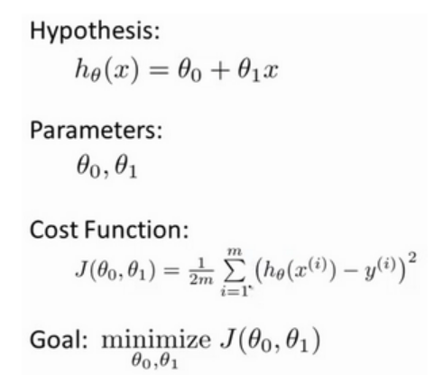  
#### 代价函数的解释（1）
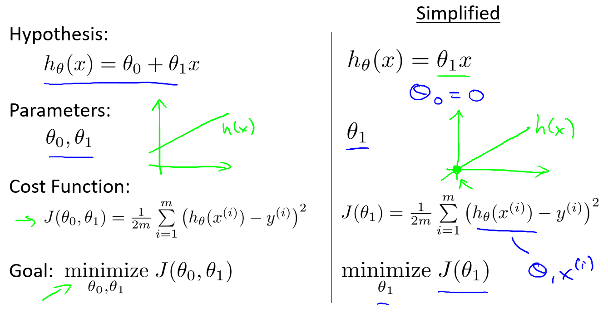  
这里先把假设函数h简化了，只讨论西塔1而不讨论西塔0  

  
左图是代价函数的几何解释：对任意西塔，假设函数与原函数的差值的平方即为代价函数在该西塔处的值，其图像为右图。  
当西塔取1时，假设函数与原函数能拟合。  
#### 代价函数的解释（2）  
当同时讨论西塔1和西塔0时，普通的二维图像难以表达它的几何意义  
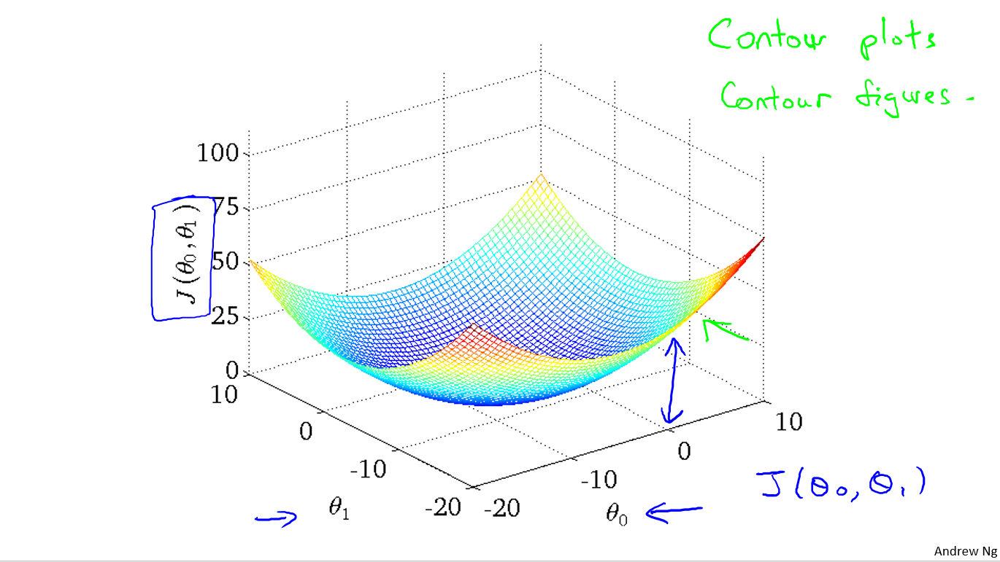  
如上图，这就可以用一个三维图像来表达，以西塔0和西塔1这两个自变量的图像  
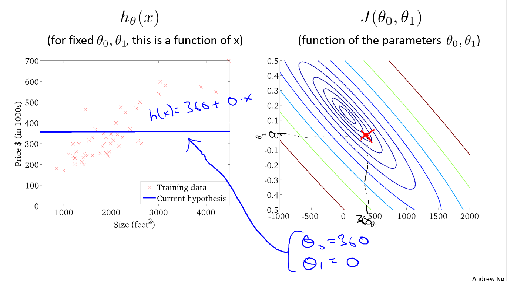  
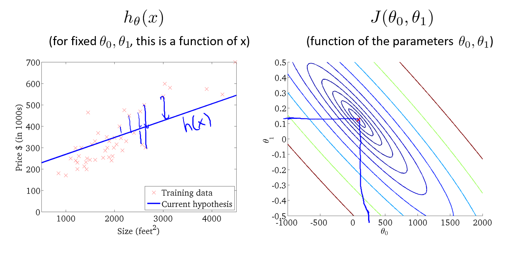  
上面两图是用等高图绘制的图像，同一椭圆线上的点即表示他们的J相同  
由上面两图就可看出，图二的函数可以较好拟合  
### 2-5 梯度下降  
#### 梯度下降是什么  
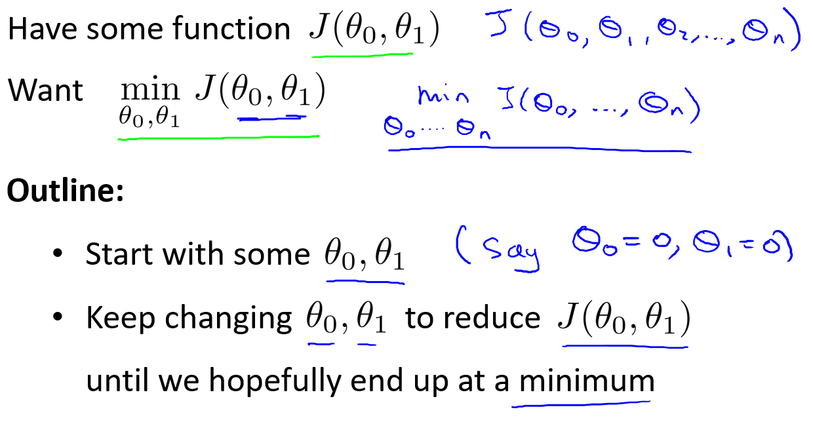  
梯度下降：是一种用来寻找最小值的算法  
梯度下降的思想：随机取一点，然后在它周围找一点比它小的点，再在周围找一个更小的点……直到找到局部最小值的点  
#### 梯度下降的解释（1）  
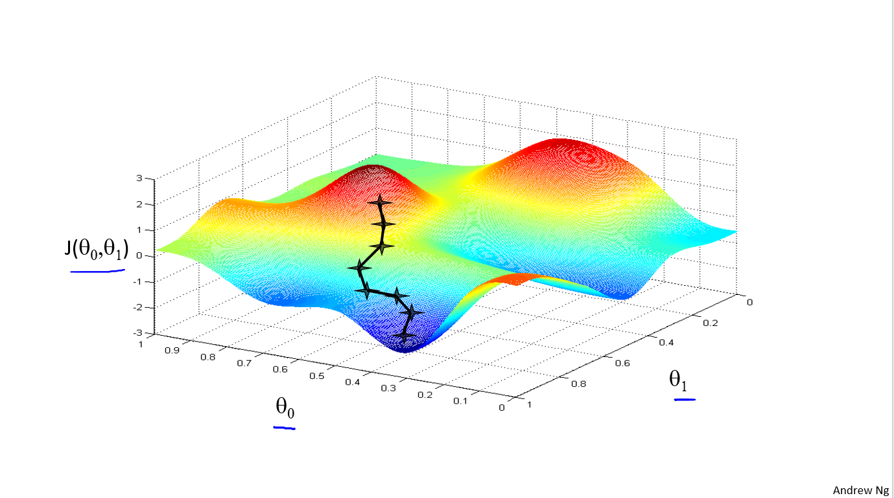  
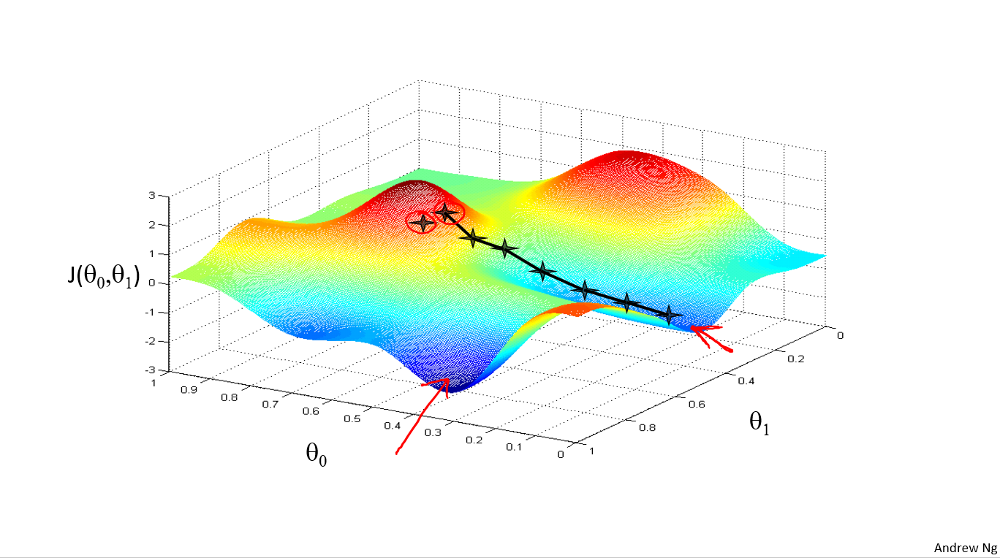  
用三维图像来解释，即随机寻找一点，接着找比它小的点，接着再找更小的点……直到找到最小的点。如图，运用梯度下降算法找到了J的两个最小值的点，说明这种算法存在缺陷。  
#### 梯度下降的解释（2）  

*“:=”：用来表示赋值；*  
*阿尔法：学习速率，用来控制梯度下降时的变化率；*  
用数学公式来解释，先用这个公式求出temp0和temp1并且分别赋值给西塔0和西塔1，然后一直更新西塔0和西塔1……  
错误的方法：求出temp0赋值给西塔0，然后求出temp1赋值给西塔1……  
### 2-6 梯度下降知识点总结  
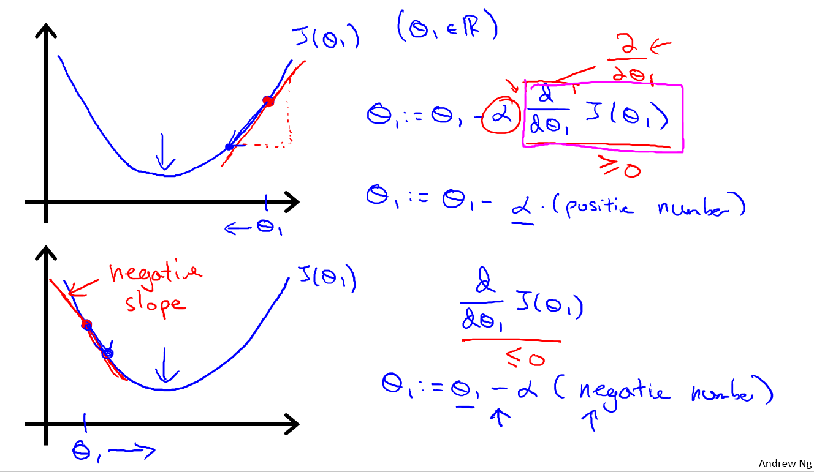  
如果只考虑西塔1一个变量，那么偏导数就可以用导数替代，从几何上定义就为图上函数的斜率。  
如果西塔1先从右边开始逼近，则偏导数那一项为正数，西塔1赋值变小，向最小值逼近。如果西塔1从左边开始逼近，则偏导数那一项为负数，西塔1赋值就变大，向最小值逼近。所以无论一开始西塔1取值为如何，都会向局部最小值逼近。  
如果阿尔法取值很小，那么变化速率则很小。如果阿尔法很大，则可能无法收敛甚至发散。  
而当阿尔法不变时，随着一次又一次的赋值，斜率会越来越小，西塔变小的幅度也会越来越小，当到达局部最小值时，斜率为0，西塔不再变化。所以没有必要另外减小阿尔法。  
### 2-7 梯度下降  
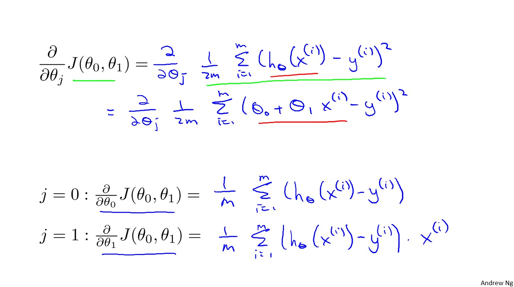  
上图是偏导数部分计算过程  
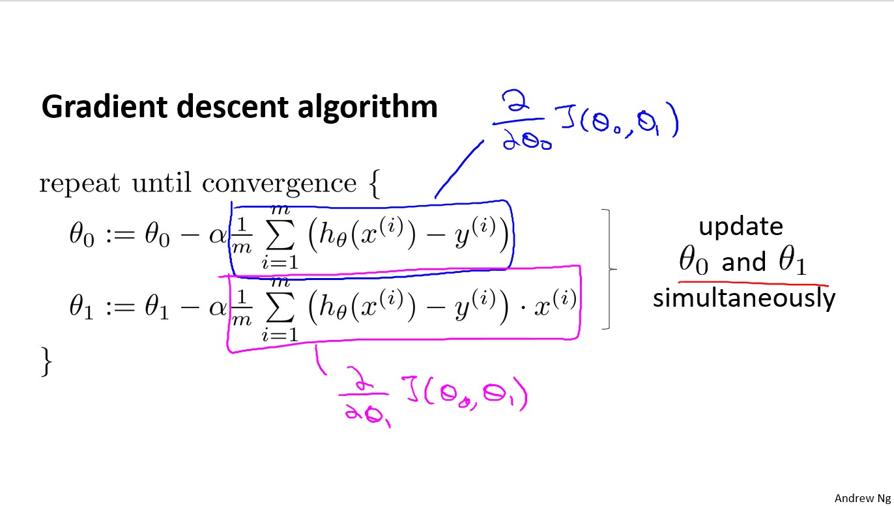  
综上所述，西塔0和西塔1最终公式如上图  

批量梯度下降：在梯度下降的每一步中，我们都用到了所有的训练样本，即m个训练样本。  

## 三 线性代数回顾  
### 3-1 矩阵和向量  
