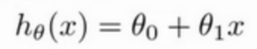
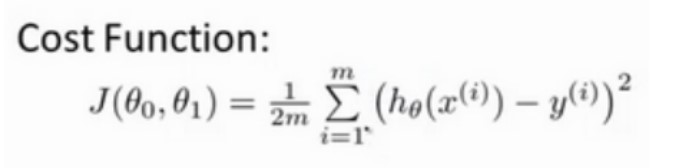
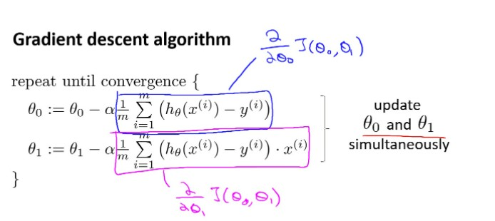

### 第二章 代价函数和梯度下降  

    第二章主要内容：  
    一堆数据需要去找到一个合适的假设函数H（西塔0，西塔1）拟合  
    然后提出了代价函数J（西塔0，西塔1）  
    当代价函数的值最小时则说明找到了最拟合的H的条件西塔0和西塔1  
    而如何找到代价函数的最小值呢？就是使用梯度下降算法来实现  
**假设函数：** H  

  

**代价函数：** 平方误差函数  

  

化简之后：  
  

**梯度下降算法：** 寻找局部最小值的方法，通过多次迭代形成。  
